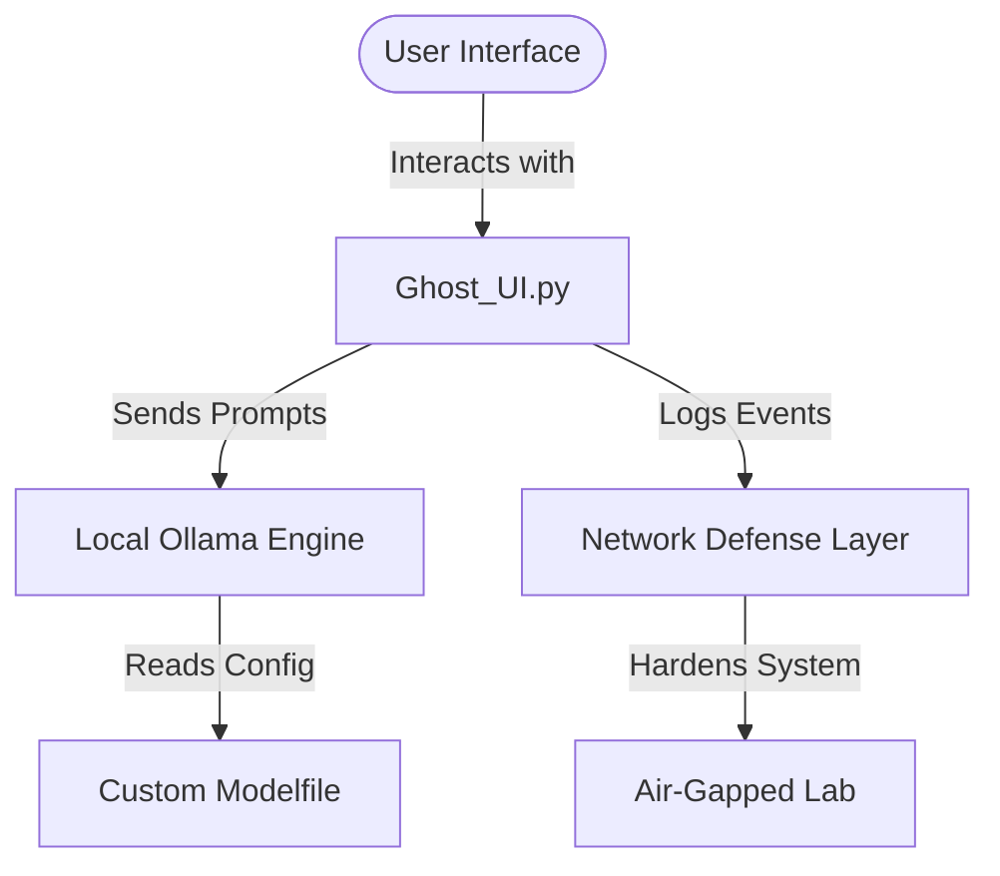

# 🏛️ The AthenaPsyche Systems & SecOps Lab

Welcome to the centralized repository for the **AthenaPsyche Systems Architecture**. This project unifies multidisciplinary research across behavioral psychology, alternative sensory data engines, and enterprise network defense.

This repository documents the structural engineering, deployment, and ongoing security hardening of a physical, multi-node testing laboratory environment.

---

## 🎛️ Operational Philosophy: System Exceptions ("Hiccups")
In this architecture, trauma-induced psychological episodes are modeled as **"System Hiccups"** rather than static triggers. This programmatic framing accounts for variable-duration runtime interruptions—capturing both short-burst disruptions and prolonged processing loops—without conforming to traditional, legacy clinical scripts.

---

## 🔌 Core Component 1: Physical Lab Topology & Hardware Grid
This lab actively maps, monitors, and isolates a complex home network environment using specialized security perimeters, physical air-gaps, and application firewalls.


| Device Name | Hardware Configuration & Operating System | Security Operational Profile |
| :--- | :--- | :--- |
| **Shadow** | Cisco Catalyst 3850 Switch (Cisco IOS) | Enterprise Core Layer / Stealth Line Isolation |
| **Grumpy** | Nighthawk RS600 Router | Central Gateway Routing Node |
| **Dragonia**| 2017 MacBook Air (macOS) | **Air-Gapped** Administration Node via Console Line |
| **Dopy**     | 2015 MacBook Pro (**Bare-Metal Kali Linux**) | **Air-Gapped** Forensic & Penetration Testing Node |
| **Felidity** | Digital Storm Desktop (Windows/Linux) | **Offline** Isolated Local AI Engine / Sneakernet |
| **Dinosaur** | 2015 iMac (macOS) | Dedicated Network Packet Analysis / Wireshark Node |
| **Bashful**  | Mac M4 2025 (macOS) | Core Production Node / LuLu Outbound Filtered |

---

## 💻 Core Component 2: The AthenaPsyche Terminal Engine
Located in the `/python-portfolio` directory, this is an interactive Python-based system engine that translates behavioral loops and network logs into executable logic models.
* **Pillar 1:** Core HPA-Axis Cortisol saturation modeling utilizing randomized data arrays.
* **Pillar 2:** Behavioral memory degradation simulated via high-loss data compression algorithms.
* **Pillar 3:** Distributed node network matrix comparing isolated terminal vulnerabilities to unified group sync frameworks.
* **Pillar 4:** SecOps infrastructure logs visualizing Cisco IOS hardware initialization protocols.

---

## 📑 Core Component 3: The SecOps Log Ledger (140+ Entry Archive)
The `/hardware-logs` directory tracks real-time configurations, terminal scrollback forensic recoveries, and strict hardware provisioning rules.

### Defensive Deployments Documented:
1. **Outbound Traffic Mitigation:** Utilizing **LuLu Application Firewall** rules on Apple Silicon architectures to enforce local storage policies and block software endpoints from transmitting metrics outside the network boundary.
2. **Physical OS Provisioning ("Sneaker Moonwalk"):** Complete deletion of consumer operating systems on legacy architectures to establish dedicated, bare-metal **Kali Linux environments** for isolated forensic analysis.
3. **Layer 2 MAC Hardening:** Implementing strict port security protocols on the enterprise switch core to eliminate lateral network traffic vectors.

---

### 🏗️ Systems Architecture



---

### 🚀 Air-Gapped Installation Guide

Follow these steps to deploy this framework in an offline, hardened environment:

1. **Download Assets (Internet-Connected Machine)**
   * Clone this repository: `git clone https://github.com`
   * Download the required local Ollama model weights from the official source.

2. **Transfer to Lab (Physical Media)**
   * Move the cloned repository folder and model files onto a secure, formatted USB drive.
   * Transfer the files directly onto your isolated, air-gapped machine.

3. **Initialize the Local AI**
   * Navigate to your repository directory on the offline machine.
   * Build your custom model using the command-line tool:
     ```bash
     ollama create secure-agent -f Modelfile
     ```

4. **Launch the Framework**
   * Run the Python user interface to begin monitoring:
     ```bash
     python Ghost_UI.py
     ```


